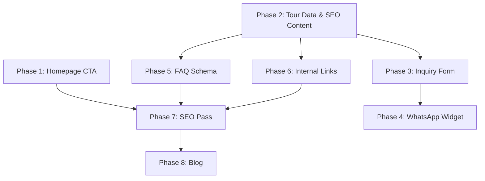

# NZ Travel & Tours — Website Overhaul Implementation Plan

## 📋 Current State Audit

### What Exists Today

| Area | Status | Files |
|------|--------|-------|
| Homepage | Hero + search widget + featured tours + "Why Journey With Us" | [page.tsx](file:///d:/Projects/NZ-Travel-Tours/src/app/page.tsx), [HeroSection.tsx](file:///d:/Projects/NZ-Travel-Tours/src/components/HeroSection.tsx) |
| Tours listing | Region/duration filters, card grid | [ToursClient.tsx](file:///d:/Projects/NZ-Travel-Tours/src/app/tours/ToursClient.tsx) |
| Tour detail `[id]` | Generic overview + placeholder itinerary + booking sidebar | [page.tsx](file:///d:/Projects/NZ-Travel-Tours/src/app/tours/%5Bid%5D/page.tsx) |
| Contact page | First/Last name, Email, Interest, Message form | [ContactClient.tsx](file:///d:/Projects/NZ-Travel-Tours/src/app/contact/ContactClient.tsx) |
| Destinations | 3 region cards (North/South/International) | [page.tsx](file:///d:/Projects/NZ-Travel-Tours/src/app/destinations/page.tsx) |
| About | Story + core values | [page.tsx](file:///d:/Projects/NZ-Travel-Tours/src/app/about/page.tsx) |
| Tour data | 16 tours in static `tours.ts` with Sanity CMS fallback | [tours.ts](file:///d:/Projects/NZ-Travel-Tours/src/data/tours.ts), [cms.ts](file:///d:/Projects/NZ-Travel-Tours/src/lib/cms.ts) |
| Build mode | Static export (`output: "export"`) | [next.config.ts](file:///d:/Projects/NZ-Travel-Tours/next.config.ts) |
| Styling | Tailwind v4 + custom brand tokens | [globals.css](file:///d:/Projects/NZ-Travel-Tours/src/app/globals.css) |

### What's Missing (Gap Analysis)

| Requested Feature | Current State | Gap |
|---|---|---|
| Primary CTA above the fold | ❌ Only search widget exists | Need "Book Now / Plan Your NZ Adventure" button |
| Sticky WhatsApp/phone button | ❌ None | Need floating widget component |
| Detailed tour pages (per-tour SEO content, itinerary, FAQs) | ⚠️ Generic placeholder content | Need rich per-tour data in `tours.ts` |
| Tour inquiry form on each tour page | ⚠️ "Book This Tour" links to `/contact` | Need inline inquiry form component |
| Budget filter | ❌ Only region + duration filters | Need budget range filter |
| Mobile responsiveness | ✅ Mostly done | Minor audit needed |
| SEO meta tags per tour | ⚠️ Basic title/description | Need full SEO titles/descriptions per tour |
| "Why Choose Us" section | ⚠️ Exists as "Why Journey With Us" but with wrong bullet points | Need updated copy per spec |
| FAQ Schema (JSON-LD) | ❌ None | Need FAQ schema on every tour page |
| Internal links at bottom of tour pages | ❌ None | Need cross-linking component |
| Blog section | ❌ None | Need `/blog` route + article pages |
| WhatsApp/live chat widget | ❌ None | Need floating WhatsApp button |
| "Why Book with NZ Travel & Tours" on every package page | ❌ None | Need reusable trust section component |
| 17th tour (Maldives base package) missing | ⚠️ Only "Maldives Luxury Overwater" exists | Need separate "Maldives" tour entry |

---

## 🏗️ Implementation Phases

### Phase 1 — Homepage Conversion Optimization
**Effort: ~1 hour · Priority: 🔴 HIGH**

#### 1.1 Add Primary CTA Above the Fold
**File:** [HeroSection.tsx](file:///d:/Projects/NZ-Travel-Tours/src/components/HeroSection.tsx)

- Add a prominent "Plan Your NZ Adventure" / "Get a Free Quote" CTA button **above** the search widget
- Button should link to `/contact` or open an inquiry modal
- Add a secondary "Browse Tours" button linking to `/tours`

#### 1.2 Update "Why Journey With Us" → "Why Choose Us"
**File:** [page.tsx](file:///d:/Projects/NZ-Travel-Tours/src/app/page.tsx) (lines 41–93)

Current bullet points:
- Bespoke Itineraries
- Local Expert Guides

Replace with the recommended copy:
- ✅ Personalized travel planning
- ✅ Budget-friendly packages
- ✅ Quick customer support
- ✅ Custom itineraries for families & groups
- ✅ Trusted travel assistance and guidance

> [!NOTE]
> The existing "Why Journey With Us" section at lines 41–93 already has the right visual structure. We only need to swap the copy and add more bullet items.

---

### Phase 2 — Enrich Tour Data & SEO Content
**Effort: ~2–3 hours · Priority: 🔴 HIGH**

#### 2.1 Expand the `Tour` Interface
**File:** [tours.ts](file:///d:/Projects/NZ-Travel-Tours/src/data/tours.ts)

Add new fields to the `Tour` interface:

```diff
 export interface Tour {
   id: string;
   title: string;
   location: string;
   duration: string;
   price: number;
   imageUrl: string;
   rating: number;
   region: 'North Island' | 'South Island' | 'Both' | 'International';
   durationDays: number;
   description?: string;
+  seoTitle?: string;
+  metaDescription?: string;
+  h1?: string;
+  highlights?: string[];
+  faqs?: { question: string; answer: string }[];
+  targetKeywords?: string[];
+  imageAltTags?: string[];
+  whyBookText?: string;
+  fullContent?: string;         // Rich SEO paragraph content
+  inclusions?: string[];
+  exclusions?: string[];
 }
```

#### 2.2 Populate All 17 Tour Entries with SEO Content
**File:** [tours.ts](file:///d:/Projects/NZ-Travel-Tours/src/data/tours.ts)

For each of the 17 tours, add:
- `seoTitle`, `metaDescription`, `h1` from the spec
- `fullContent` — **Rewrite the provided AI-sounding content** into natural, human-sounding prose
- `highlights` array from the spec
- `faqs` array from the spec
- `targetKeywords` array
- `imageAltTags` array

> [!IMPORTANT]
> The provided SEO content reads somewhat AI-generated. During implementation, I will **humanize the tone** — varying sentence lengths, adding specifics, removing generic superlatives, and injecting personality (e.g., "You'll want to pinch yourself when you see Lake Wakatipu at dawn" instead of "Queenstown delivers unforgettable moments in every season").

**Missing tour to add:** The spec lists a separate "Maldives" tour (#4) distinct from "Maldives Luxury Overwater" (#15). Need to add tour ID `"17"` for the base Maldives package.

#### 2.3 Update Tour Detail Page to Use Rich Content
**File:** [page.tsx](file:///d:/Projects/NZ-Travel-Tours/src/app/tours/%5Bid%5D/page.tsx)

- Use `seoTitle` and `metaDescription` in `generateMetadata()`
- Render `fullContent` instead of generic placeholder text
- Render `highlights` as a styled list
- Render `faqs` as an accordion/expandable section
- Render `inclusions`/`exclusions` if present
- Add "Why Book with NZ Travel & Tours?" trust section
- Add internal links section at the bottom

---

### Phase 3 — Tour Inquiry Form Component
**Effort: ~1.5 hours · Priority: 🔴 HIGH**

#### 3.1 Create `TourInquiryForm` Component
**New file:** `src/components/TourInquiryForm.tsx`

Form fields per spec:
- Name
- WhatsApp Number
- Email
- Travel Date
- No. of People
- Destination (pre-filled from tour title)
- Budget Range (dropdown)
- Message

This is a `"use client"` component. On submit, it can:
1. Send data via `mailto:` link (simplest for static export)
2. Or use a third-party form service (Formspree, Web3Forms) for email delivery

#### 3.2 Embed Inquiry Form on Tour Detail Pages
**File:** [page.tsx](file:///d:/Projects/NZ-Travel-Tours/src/app/tours/%5Bid%5D/page.tsx)

- Replace or supplement the current "Book This Tour" sidebar with the inline `TourInquiryForm`
- The form should appear below the tour content AND in the sidebar (sticky)

#### 3.3 Update Contact Page Form
**File:** [ContactClient.tsx](file:///d:/Projects/NZ-Travel-Tours/src/app/contact/ContactClient.tsx)

- Add missing fields: WhatsApp Number, Travel Date, No. of People, Budget Range
- Keep the existing interest/tour pre-fill via URL param

---

### Phase 4 — Floating WhatsApp Widget
**Effort: ~30 min · Priority: 🟡 MEDIUM**

#### 4.1 Create `WhatsAppWidget` Component
**New file:** `src/components/WhatsAppWidget.tsx`

- Fixed-position floating button (bottom-right corner)
- Green WhatsApp icon with pulse animation
- Links to `https://wa.me/<YOUR_NUMBER>?text=Hi, I'm interested in NZ Travel & Tours`
- Stays visible on scroll across all pages
- Mobile-friendly tap target (min 48×48px)

#### 4.2 Add to Root Layout
**File:** [layout.tsx](file:///d:/Projects/NZ-Travel-Tours/src/app/layout.tsx)

```diff
+        <WhatsAppWidget />
         <Footer />
```

---

### Phase 5 — FAQ Schema (JSON-LD) for SEO
**Effort: ~45 min · Priority: 🟡 MEDIUM**

#### 5.1 Create `FaqSchema` Component
**New file:** `src/components/FaqSchema.tsx`

- Accepts `faqs: { question: string; answer: string }[]`
- Renders a `<script type="application/ld+json">` tag with `FAQPage` structured data
- Renders the FAQ visually as an accordion

#### 5.2 Inject on Tour Detail Pages
**File:** [page.tsx](file:///d:/Projects/NZ-Travel-Tours/src/app/tours/%5Bid%5D/page.tsx)

- Import `FaqSchema` and pass each tour's `faqs` array

---

### Phase 6 — Internal Linking Component
**Effort: ~30 min · Priority: 🟡 MEDIUM**

#### 6.1 Create `RelatedTours` Component
**New file:** `src/components/RelatedTours.tsx`

- Displays 3–4 links to other tour pages at the bottom of each tour detail page
- Includes links like "Explore Queenstown Packages", "View Auckland Tours", "Contact NZ Travel & Tours"
- Uses the tours data to dynamically generate related tour links based on region

#### 6.2 Create `WhyBookWithUs` Component
**New file:** `src/components/WhyBookWithUs.tsx`

- Reusable trust section with the standard copy:
  - Customized packages based on your budget
  - Professional travel guidance and support
  - Flexible itinerary options
  - Family, honeymoon, and group-friendly tours
  - Fast response on WhatsApp & Email

---

### Phase 7 — SEO Metadata & Content Quality Pass
**Effort: ~1 hour · Priority: 🟡 MEDIUM**

#### 7.1 Update Root Layout Metadata
**File:** [layout.tsx](file:///d:/Projects/NZ-Travel-Tours/src/app/layout.tsx)

- Update default `title` and `description` to be keyword-rich
- Add `keywords` meta tag

#### 7.2 Update All Page-Level Metadata
**Files:** All `page.tsx` files

- Update `metadata` exports with keyword-optimized titles and descriptions for:
  - Tours listing page
  - Destinations page
  - About page
  - Contact page

#### 7.3 Add Budget Filter to Tours Page
**File:** [ToursClient.tsx](file:///d:/Projects/NZ-Travel-Tours/src/app/tours/ToursClient.tsx)

- Add a "Budget Range" dropdown filter (e.g., Under $1000, $1000–$2000, $2000–$3000, $3000+)
- Wire into the existing filter logic

#### 7.4 Add "Activity Type" Filter
**File:** [ToursClient.tsx](file:///d:/Projects/NZ-Travel-Tours/src/app/tours/ToursClient.tsx)

- Add activity type field to `Tour` interface (adventure, cultural, relaxation, spiritual, city)
- Add dropdown filter

---

### Phase 8 — Blog Section (Future Content Hub)
**Effort: ~2–3 hours · Priority: 🟢 LOW (but high SEO impact)**

#### 8.1 Create Blog Data Structure
**New file:** `src/data/blogPosts.ts`

- Define `BlogPost` interface: `id, slug, title, excerpt, content, category, publishDate, imageUrl, seoTitle, metaDescription`
- Seed with 3–5 initial articles from the recommended topics

#### 8.2 Create Blog Listing Page
**New file:** `src/app/blog/page.tsx`

- Grid of blog post cards
- Category filter
- SEO metadata

#### 8.3 Create Blog Post Detail Page
**New file:** `src/app/blog/[slug]/page.tsx`

- Full article rendering
- Related posts sidebar
- "Plan Your Trip" CTA
- `generateStaticParams()` for static export

#### 8.4 Add Blog to Navigation
**File:** [Header.tsx](file:///d:/Projects/NZ-Travel-Tours/src/components/Header.tsx)

- Add "Blog" link to desktop and mobile nav

#### 8.5 Add Blog to Footer
**File:** [Footer.tsx](file:///d:/Projects/NZ-Travel-Tours/src/components/Footer.tsx)

- Add "Travel Blog" link in Quick Links

---

## 📁 Complete File Change Summary

### New Files to Create (9)

| File | Purpose |
|------|---------|
| `src/components/TourInquiryForm.tsx` | Inquiry form with all required fields |
| `src/components/WhatsAppWidget.tsx` | Floating WhatsApp chat button |
| `src/components/FaqSchema.tsx` | FAQ JSON-LD schema + visual accordion |
| `src/components/RelatedTours.tsx` | Internal links at bottom of tour pages |
| `src/components/WhyBookWithUs.tsx` | Trust section for all package pages |
| `src/data/blogPosts.ts` | Blog post data structure and seed content |
| `src/app/blog/page.tsx` | Blog listing page |
| `src/app/blog/[slug]/page.tsx` | Blog post detail page |
| `src/components/BlogCard.tsx` | Blog post card for listing grid |

### Existing Files to Modify (11)

| File | Changes |
|------|---------|
| `src/data/tours.ts` | Expand interface + add SEO content for all 17 tours + add Maldives base tour |
| `src/components/HeroSection.tsx` | Add CTA buttons above search widget |
| `src/app/page.tsx` | Update "Why Choose Us" copy |
| `src/app/tours/[id]/page.tsx` | Major overhaul — rich content, FAQ, inquiry form, trust section, internal links |
| `src/app/tours/ToursClient.tsx` | Add budget + activity type filters |
| `src/app/contact/ContactClient.tsx` | Add WhatsApp, travel date, people, budget fields |
| `src/app/layout.tsx` | Add WhatsApp widget + update default metadata |
| `src/components/Header.tsx` | Add Blog nav link |
| `src/components/Footer.tsx` | Add Blog link + update social links |
| `src/app/globals.css` | Add FAQ accordion animations + WhatsApp pulse animation |
| `src/lib/cms.ts` | Update Sanity queries for new fields |

---

## ⏱️ Effort Estimate Summary

| Phase | Description | Effort |
|-------|------------|--------|
| 1 | Homepage Conversion (CTA + Why Choose Us) | ~1 hr |
| 2 | Tour Data & SEO Content (all 17 tours) | ~2–3 hrs |
| 3 | Tour Inquiry Form | ~1.5 hrs |
| 4 | WhatsApp Widget | ~30 min |
| 5 | FAQ Schema (JSON-LD) | ~45 min |
| 6 | Internal Links + Trust Section | ~30 min |
| 7 | SEO Metadata + Filters | ~1 hr |
| 8 | Blog Section | ~2–3 hrs |
| **Total** | | **~9–11 hrs** |

---

## 🔗 Dependency Order



> [!TIP]
> **Recommended execution order:** Phase 2 → Phase 1 → Phase 3 → Phase 5 → Phase 6 → Phase 4 → Phase 7 → Phase 8
> 
> Start with the data layer (Phase 2) since most other phases depend on the enriched tour data.

---

## ⚠️ Key Technical Considerations

1. **Static Export Constraint:** The site uses `output: "export"`. All pages must be statically renderable. No server-side API routes, no dynamic server rendering. Blog and tour pages must use `generateStaticParams()`.

2. **Form Submission:** Since there's no server, form submissions need a third-party service (Formspree, Web3Forms, or `mailto:` fallback). Recommend **Web3Forms** (free tier, no backend needed).

3. **SEO Content Tone:** The provided copy will be humanized during implementation to avoid AI-detection flags. Key changes: varied sentence structure, specific details over generic praise, conversational tone, and local flavor.

4. **Sanity CMS Sync:** The `cms.ts` layer has Sanity fallback. New fields in `tours.ts` should also be reflected in the Sanity schema (`src/sanity/schemaTypes/tour.ts`) for future CMS management.

5. **Image Strategy:** Tour pages reference Unsplash URLs. For production, these should be replaced with self-hosted or CDN-served images for reliability.
